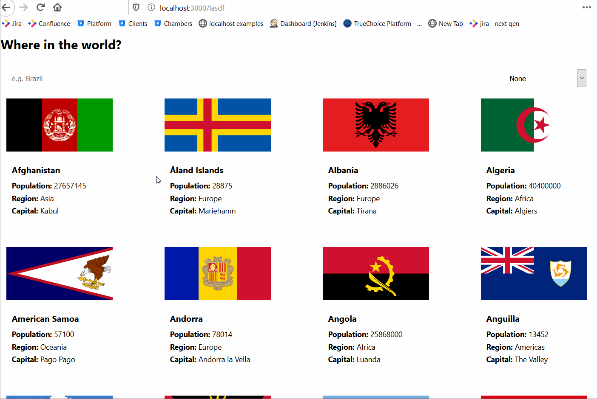

# Countries

## Description

[Live link](https://bryg217.github.io/countries/)

**Note: Only tested on latest versions of Firefox and Chrome.**

"Countries" is a small project where a user can load all of the countries
on the home page, all at one time, and then, the user could click on the
country cards, and then see a "summary" page for said country.

This project is actually a more "barebones" version of
[this](https://www.frontendmentor.io/challenges/rest-countries-api-with-color-theme-switcher-5cacc469fec04111f7b848ca)
project.

Before moving forward, the keyword, "barebones" used above is crucial.
Contrary to the link, I stripped a few things out of my implementation:

* Background Color
* Dark Theme
* Additional Content + Buttons in Summary Page
* Not Optimized (i.e. all countries are loaded at once, and filtering could be better)

The reason for this is that my implementation was really focused around the
fetching of data, managing that state across different routes, and also with
different filters applied.

**Note: Given the all of the information above, it is worth emphasizing that
this implementation is not the most performant nor entirely complete from
a feature standpoint, as mentioned above.  For more information, see improvements
section.**

## Files of Focus

Below, I list the files/directories that are of particular interest for this project.

1. `./src/App.js`
2. `./src/pages/home/`
3. `./src/components/`

## Running App Locally

1. Run `git pull`
2. Run `npm i`
3. Run `npm run start`

## Improvements

This project could be improved in many ways, and worth noting:

1. Performance
2. UI: Colors and data