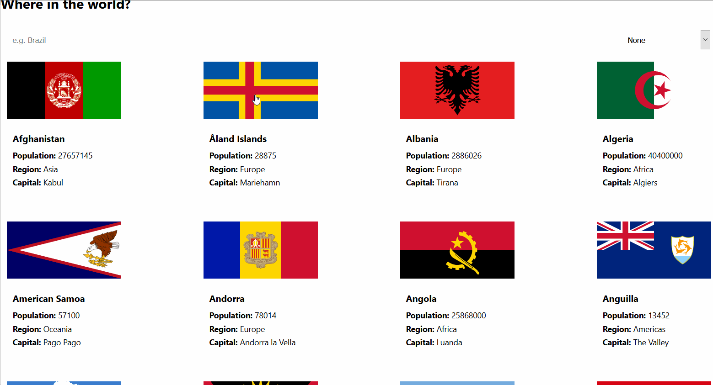

# Countries

## Description

[Live link](https://bryg217.github.io/countries/)

**Note: Only tested on latest versions of Firefox and Chrome.**

**Note: The implementation for managing state comes from my [blog post](https://bryg217.github.io/bryans-blog/posts/2-state/).**

"Countries" is a small project where a user can load all of the countries
on the home page (all at once).  Once the home page is loaded, the user could
then interact with the application by click on the countries to learn more
about each -- a summary page of sorts.

This project is actually a more "barebones" version of
[this](https://www.frontendmentor.io/challenges/rest-countries-api-with-color-theme-switcher-5cacc469fec04111f7b848ca)
project.

Before moving forward, the keyword, "barebones" used above is crucial.
Contrary to the link, I stripped a few things out of my implementation:

* Background Color
* Dark Theme
* Additional Content + Buttons in Summary Page
* Not Fully Optimized (i.e. lazy loading of images on home is implemented, but all countries are added to the DOM on load, which means 200 plus `div` elements at once)

The reason for this is that my implementation was really focused around:  **state management**.

Here, the focus was around implementing state management without Redux.  As mentioned above, you could check more of that out at my blog, [here](https://bryg217.github.io/bryans-blog/posts/2-state/).

## Files of Focus

Below, I list the files/directories that are of particular interest for this project.

1. `./src/App.js`
2. `./src/state.js`
3. `./src/pages/home/`
4. `./src/components/`

## Running App Locally

1. Run `git pull`
2. Run `npm i`
3. Run `npm run start`

## Improvements

This project could be improved in many ways, and worth noting:

1. Performance: Don't add all elements to the DOM on load.
2. UI: Colors and data